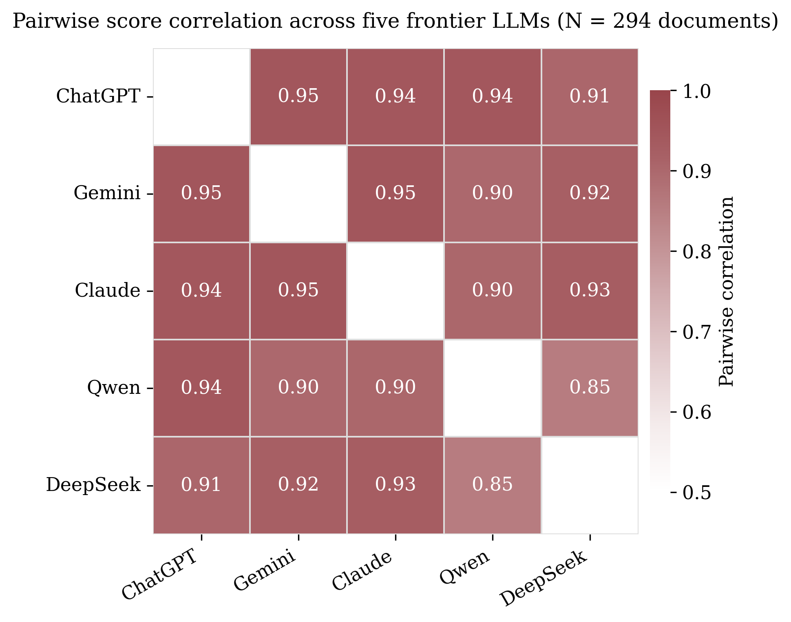

# Multi-LLM Validation for Archival Text Measurement

A small, runnable demo of the validation methodology I use when treating
large language models as a measurement instrument on historical documents.
This is the public-facing companion to my job market paper, *Democratic
Exposure and Elite Ideology: Evidence from Treaty Ports in Imperial China*.

## Why this exists

When you ask an LLM to score 19th-century Classical Chinese archival texts
for political sentiment, the obvious question is: how do you know the score
is measuring what you say it's measuring, and not an idiosyncrasy of one
model's training data?

Hand-coding by domain experts is the gold standard but is expensive and
slow at scale. The pragmatic alternative — used in this repo — is to score
the same corpus independently with several frontier models and treat their
agreement as a (lower-bound) reliability signal. Strong inter-model
agreement does not prove the measurement is correct, but weak agreement is
a hard ceiling on how seriously any single-model score can be taken.

## Result

I scored 294 archival documents (1898 official responses to a Qing-era
democratic-reform memorial) independently with five frontier LLMs:
**ChatGPT, Gemini, Claude, Qwen, and DeepSeek**. Pairwise score
correlations across the five-by-five model panel are all in the
**0.85 – 0.95** range, with a mean of **0.92**. The single tightest pair
is ChatGPT × Gemini (0.95); the loosest is Qwen × DeepSeek (0.85).



This is the validation backbone reported in my JMP. It is complemented in
the full paper by hand-coded subsamples and held-out test documents.

## What's in this repo

| File | What it does |
| --- | --- |
| `multi_llm_scoring.py` | Reference implementation of the parallel five-provider scoring pipeline (OpenAI / Gemini / Anthropic / DashScope-Qwen / DeepSeek), with strict JSON-schema validation, retries, and a pluggable prompt template. |
| `correlation_analysis.py` | Loads the aggregated score CSV, computes the pairwise correlation matrix, and generates the heatmap (color and B&W versions). |
| `data/llm_scores_aggregated.csv` | 294 documents × 5 model scores. **Only aggregate scores are released here**; the underlying Classical Chinese text and any author identifiers remain in the private research repo. |
| `figures/` | The two heatmap PNGs, regenerated by running `correlation_analysis.py`. |
| `requirements.txt` | Pinned dependencies. |

## Reproducing the figure

```bash
python -m venv .venv && source .venv/bin/activate
pip install -r requirements.txt
python correlation_analysis.py
```

You should see the same correlation matrix and figures regenerated.

## Adapting this to your own corpus

The scoring contract in `multi_llm_scoring.py` is intentionally generic.
To reuse it on a different measurement task:

1. Replace `PROMPT_TEMPLATE` with your own scoring prompt, keeping the
   "Return JSON only with this exact schema" pattern so `parse_score`
   stays valid.
2. Set the API keys for the providers you want
   (`OPENAI_API_KEY`, `GOOGLE_API_KEY`, `ANTHROPIC_API_KEY`,
   `DASHSCOPE_API_KEY`, `DEEPSEEK_API_KEY`).
3. Pass `documents` as a `{doc_id: text}` mapping into
   `score_corpus_parallel`. One row per (document, model) is returned.

## What's intentionally not in this repo

- The Classical Chinese source text and any author-level identifiers.
  Those stay in the private research repo (`AIER_OS_Qing`) until the JMP
  is publicly released.
- The full prompt-versioning, OCR, and provenance-logging stack. That is
  part of **AIER OS** (AI Econ Research Operating System), my private
  multi-agent research platform.

## License

MIT. See `LICENSE`.

## Author

**Steve Zhiwen Wang** — PhD candidate, Department of Economics,
University of Pittsburgh.
[zhw94@pitt.edu](mailto:zhw94@pitt.edu) · [zhiwen-wang.com](https://www.zhiwen-wang.com)
